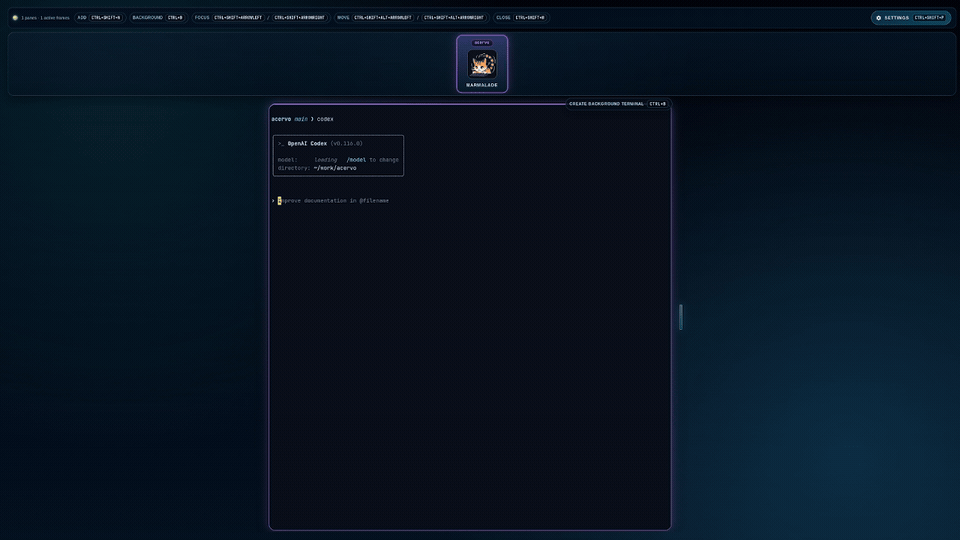

# agentz

agentz is a desktop terminal workspace built around a live avatar strip that shows what each pane is doing at a glance while still giving you real PTY-backed terminals underneath.

## Demo



The avatar strip is the main UI. Each pane gets an assigned avatar, and that avatar updates in real time to reflect pane activity:

- `idle` when the pane is waiting
- `working` when the pane is actively running or streaming work
- `question` when the pane needs input or approval
- `calling` when the pane is delegating or using sub-agents

Under the strip, each avatar maps to a real terminal pane with native-style alternate-screen behavior for tools like `nvim`, `less`, `tmux`, and `opencode`.
Panes can also keep a paired background terminal so you can flip between the main terminal and background work without losing context.

## Features

- Live avatar strip that lets you scan pane activity without reading every terminal
- Real-time avatar state changes for idle, working, question, and calling states
- Stable avatar-to-pane mapping so each pane keeps a recognizable identity
- 10 named avatars to assign to panes: Marmalade, Nyx, Byte, Glimmer, Wisp, Rufus, Selene, Bamboo, Mochi, and Pyra
- Multiple real terminal panes in one desktop window
- Per-pane background terminals you can toggle in and out without replacing the main session
- PTY-backed sessions, not fake terminal emulation shortcuts
- Native-style alternate-screen behavior through the Ghostty VT bridge
- Working mouse input for terminal TUIs like `nvim`
- Shell scrollback and prompt behavior that stays readable
- Resizable panes with drag handles
- Per-pane working directory tracking with automatic folder color assignments
- Inactive pane previews showing shell output when not focused
- Image paste support - paste images from clipboard directly into the terminal (writes to temp file and sends path)
- Settings modal for customization
- Fully customizable keyboard shortcuts
- Configurable default pane width
- Adjustable visible live pane count (1-9, odd numbers for best layout)

## Downloads

Latest release:

- `https://github.com/horvay/agentz/releases/latest`

Release assets:

- `*.dmg` for macOS
- `*.exe` for Windows
- `*.AppImage` for Linux

## Install And Run

### macOS

1. Download the latest `*.dmg`.
2. Install the app normally.
3. Launch `agentz`.

Use the `.dmg` release asset on macOS rather than a raw app bundle or zip export.

### Windows

1. Download the latest `*.exe`.
2. Run the installer.
3. Launch `agentz`.

### Linux

1. Download the latest `*.AppImage`.
2. Mark it executable.
3. Run it.

```bash
chmod +x ./agentz-*.AppImage
./agentz-*.AppImage
```

## Keyboard Shortcuts

All shortcuts are customizable in the Settings modal (Ctrl+Shift+P):

| Action | Default Shortcut |
|--------|-----------------|
| Add pane | `Ctrl+Shift+N` |
| Toggle background terminal | `Ctrl+B` |
| Focus previous pane | `Ctrl+Shift+ArrowLeft` |
| Focus next pane | `Ctrl+Shift+ArrowRight` |
| Move pane left | `Ctrl+Alt+Shift+ArrowLeft` |
| Move pane right | `Ctrl+Alt+Shift+ArrowRight` |
| Close pane | `Ctrl+Shift+W` |
| Open settings | `Ctrl+Shift+P` |

Shortcuts require at least one modifier key and are validated for conflicts.

## Development

### Setup

```bash
bun install
bun run native:build
```

### Run The Desktop App

```bash
bun run dev
```

### Run Web Mode

```bash
bun run web
```

Web mode stays local-only:

- UI: `http://127.0.0.1:5173`
- RPC backend: `ws://127.0.0.1:4599`

Remote/network access is intentionally disabled until that path is secured.

### Launch Panes With Predefined Commands

```bash
# Start one pane with opencode
bun run dev:launch -- --pane-1-opencode

# Start multiple panes with different commands
bun run dev:launch -- --pane-1-opencode --pane-2-cmd=bash --pane-2-args=-lc,ls
```

Supported flags:

- `--pane-<n>-cmd=<command>`
- `--pane-<n>-args=<arg1,arg2,...>`
- `--pane-<n>-cwd=<path>`
- `--pane-<n>-opencode`

## Testing

Primary interactive validation target:

- `opencode`

Basic smoke check:

```bash
bun run test:opencode
```

Useful screenshot checks:

```bash
bun run test:opencode:screenshot
bun run test:opencode:add-pane:screenshot
bun run test:nvim:screenshot
bun run test:shell:scroll:screenshot
```

## Release Builds

Build a local release artifact:

```bash
bun run release:stable
```

Current packaged outputs:

- Linux: `AppImage`
- macOS: `dmg`
- Windows: `nsis` installer

### macOS Release Signing

GitHub Releases should only publish macOS installers from a signed and notarized CI build.

Required repository secrets for the macOS release job:

- `CSC_LINK`
- `CSC_KEY_PASSWORD`
- `APPLE_API_KEY_P8`
- `APPLE_API_KEY_ID`
- `APPLE_API_ISSUER`

For local development builds on macOS, Gatekeeper quarantine can block an unsigned app bundle. If you trust your own local build and need to test it manually:

```bash
xattr -dr com.apple.quarantine /path/to/agentz.app
```

## Configuration

agentz stores its configuration at:

- Linux: `~/.config/agentz/config.json` (XDG compliant, or `XDG_CONFIG_HOME/agentz/config.json`)
- macOS: `~/.config/agentz/config.json`
- Windows: `%APPDATA%\agentz\config.json`

The config file is created automatically on first run. You can edit it directly or use the Settings modal (Ctrl+Shift+P).

## Notes

### Linux X11 Focus

On some Linux/X11 setups, Electrobun may not forward keyboard input until the first pointer interaction. agentz applies a one-time startup nudge using `xdotool` to handle that automatically.

To disable it:

```bash
AGENTZ_DISABLE_X11_INPUT_NUDGE=1 bun run dev
```

## Project Layout

- `src/main/` main process, terminal manager, PTY sessions, RPC server
- `src/ui/` React UI, pane layout, xterm rendering, input handling
- `src/native/` Zig native PTY host and Ghostty VT integration
- `deps/ghostty/` Ghostty source used for VT behavior research and bridge integration
- `scripts/` smoke tests, screenshot tests, and packaging helpers
